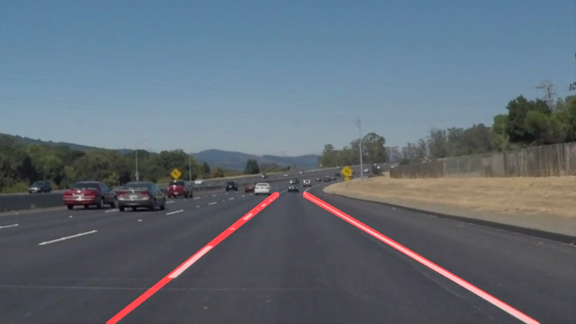
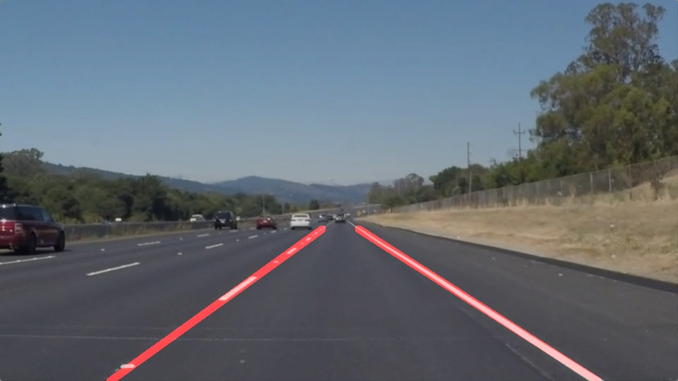
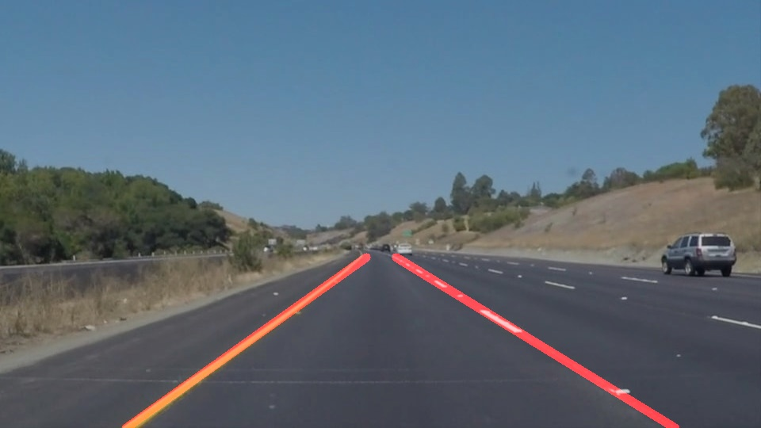
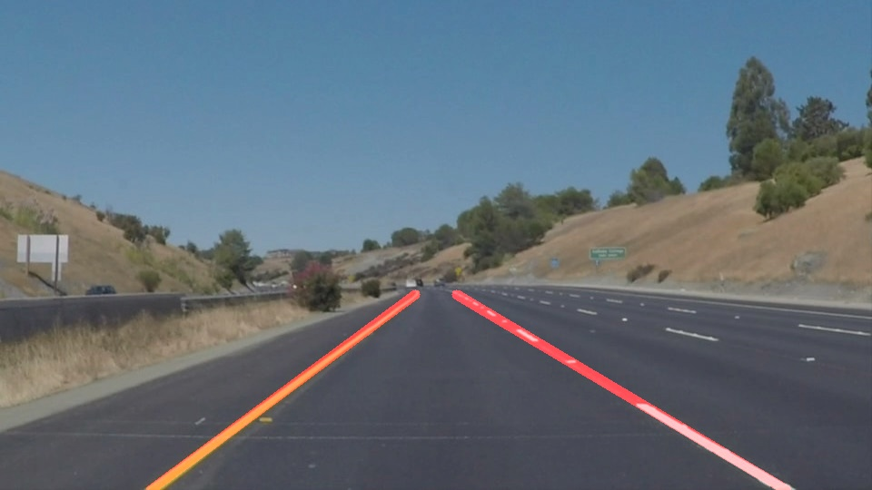
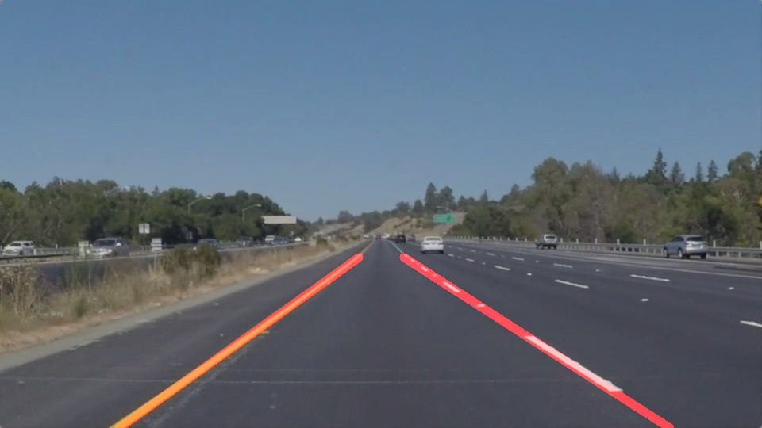
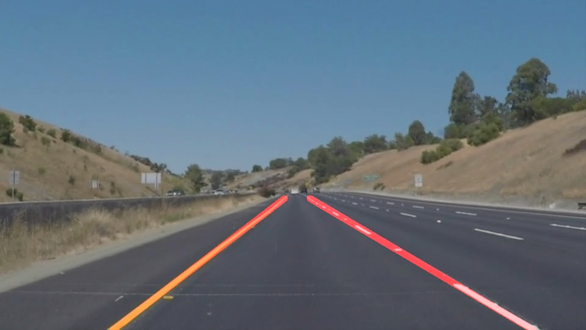

# **Finding Lane Lines on the Road** 

---

## Purpose

* Make a pipeline that finds lane lines on the road
* Reflect on your work in a written report

---

## Reflection

### My pipeline

My pipeline consists of 5 steps.

1. Convert input image to grayscale
2. Apply gaussian blur to grayscale image in order to detect edge
3. Apply Canny Edge Detector to blur image
4. Create ROI mask by specifying pixels of rectangle in order to ignore unnecessary edges
5. Apply Hough Transform in order to detect line segments

The following are example results of my pipeline.

### Improvement of draw_lines() function

In order to draw a single line on the left and right lanes, I modified the draw_lines() function by:

* Split lines into left/right groups by considering 'position of start point' and 'slope of line'
* Estimate average line by calculating equations of lines and taking their average
* Calculate new (x1, y1, x2, y2) from equation of average line

### Potential shortcomings with my current pipeline

Potential shortcomings would be:

* My pipeline can only straight lines

### Suggestion of possible improvements to my pipeline

Possible improvements would be:

* Change line equations to non-linear so that it can represent curve lines
